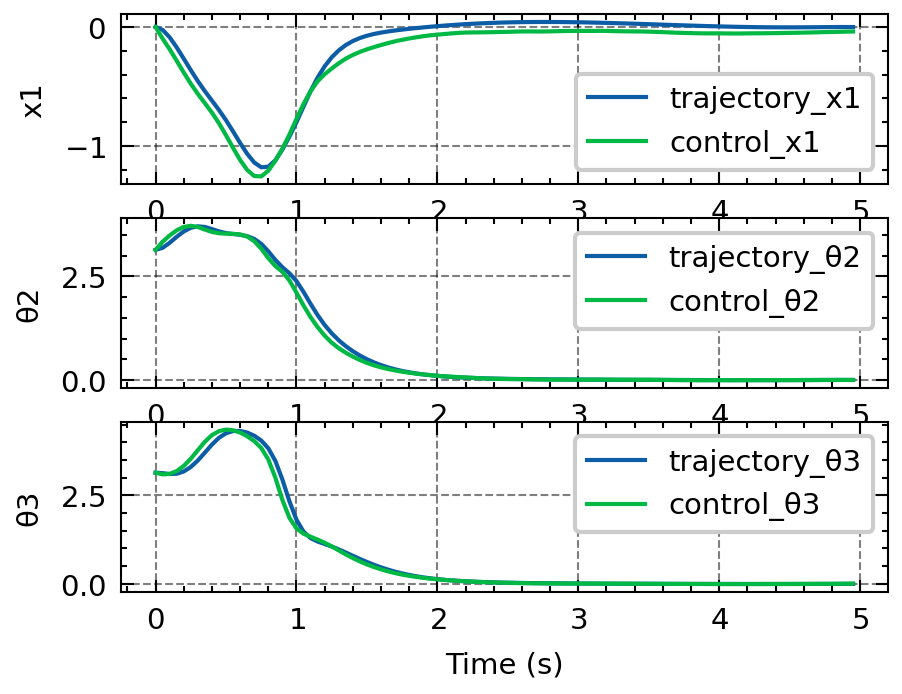
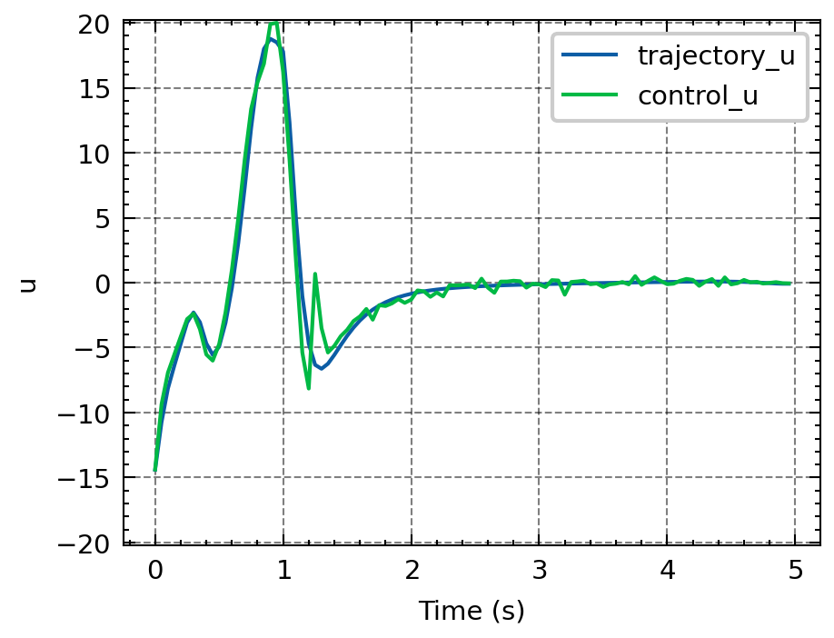
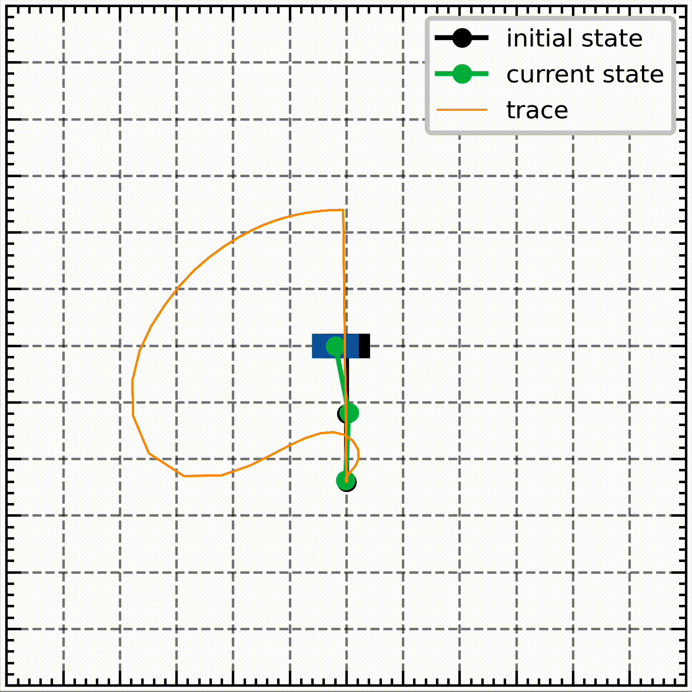

# Cart Double-Pendulum: Trajectory Optimization and Control

## Abstract
This project focuses on modeling and controlling a cart double-pendulum system by combining offline trajectory optimization with an online Time-Variant Linear Quadratic Regulator (TVLQR). The objective is to swing up the pendulum and stabilize it at the upright position while handling disturbances. The workflow includes:

- **System Modeling:** The cart double-pendulum system is modeled with nonlinear dynamics in the x-y plane.
- **Trajectory Optimization:** A nonlinear optimization approach is used to compute a feasible swing-up trajectory while minimizing a cost function.
- **Control via TVLQR:** A time-variant LQR controller stabilizes the system along the optimized trajectory, with performance tested under noisy conditions.

Results demonstrate successful trajectory optimization and control implementation, with robustness analysis under disturbances. The effectiveness of TVLQR in stabilizing the system highlights the importance of precise state estimation and control.

---

## Visualizations

### Swing-up Trajectory Optimization and Control
|States|Controls|
|---|---|
|| |

### Simulation GIF

---

## Code and Implementation
The implementation includes:
- System dynamics using Runge-Kutta integration.
- Trajectory optimization via direct collocation.
- TVLQR-based control with noise robustness evaluation.
